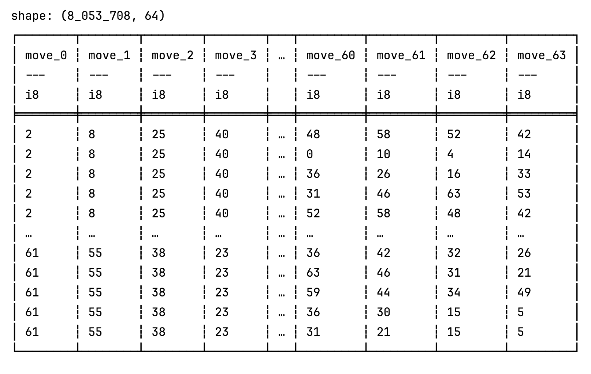
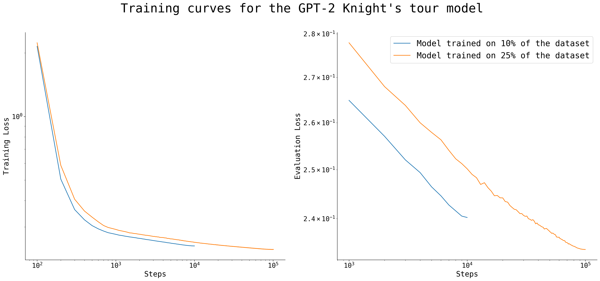
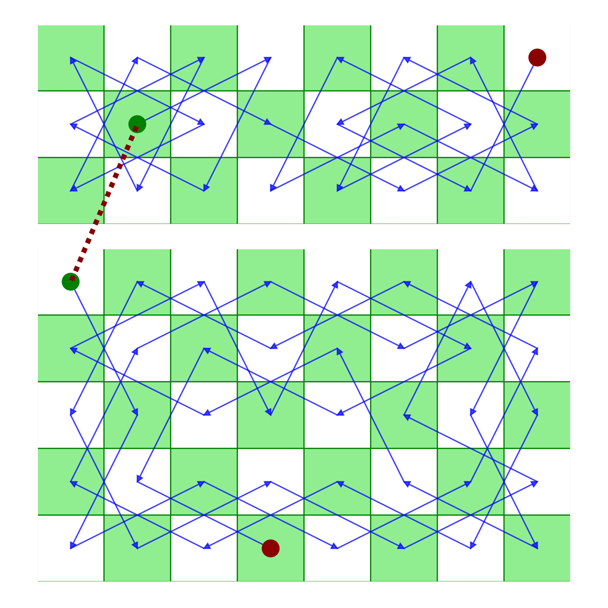
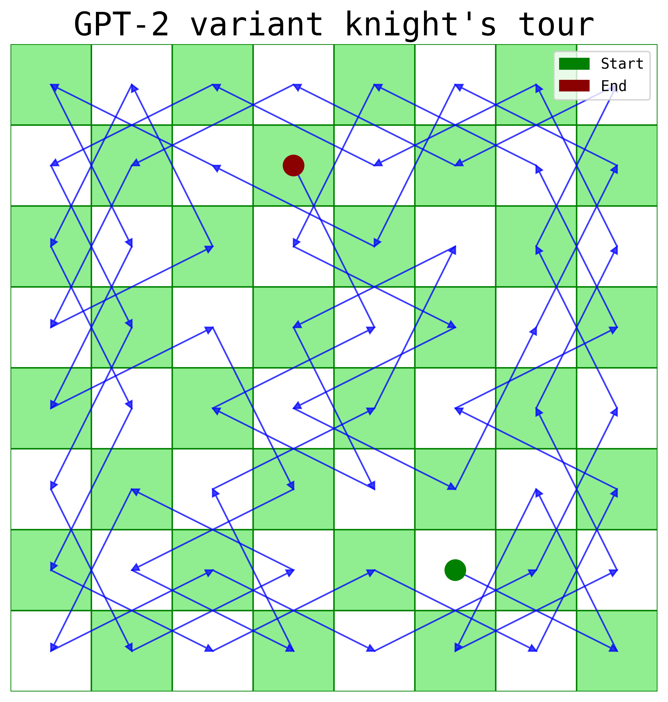
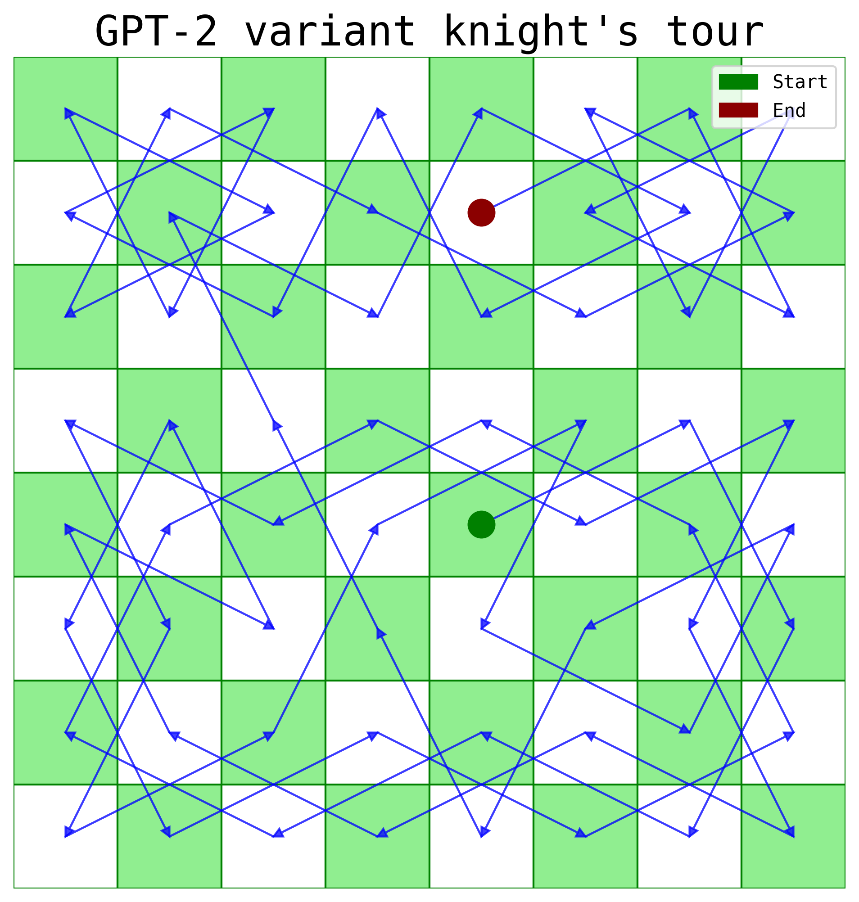
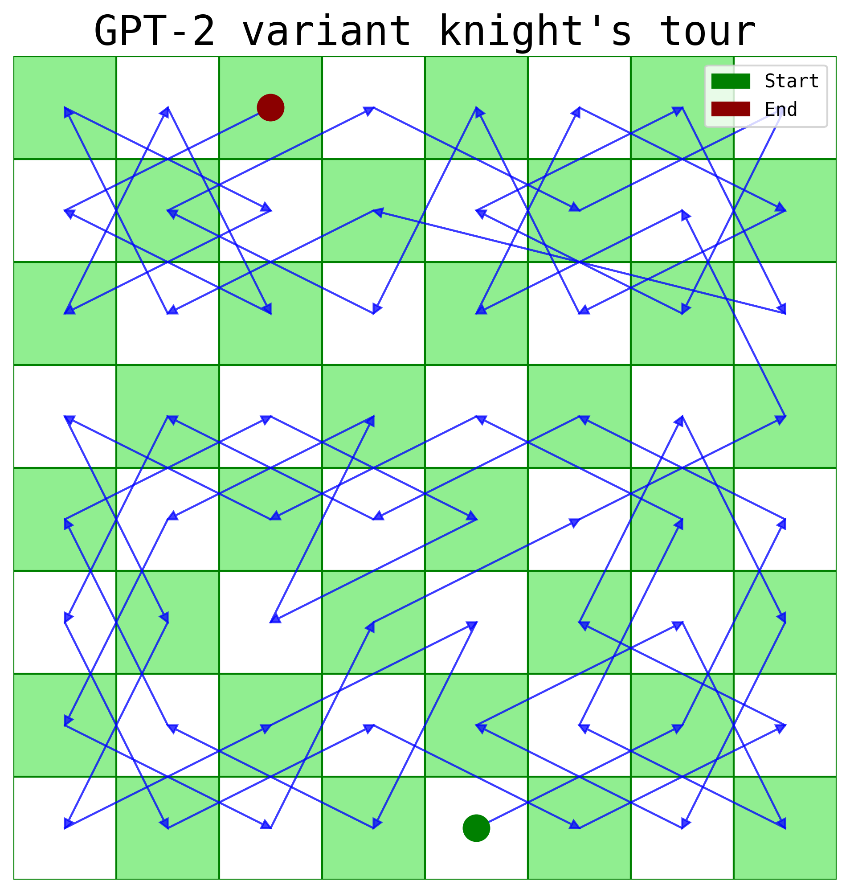
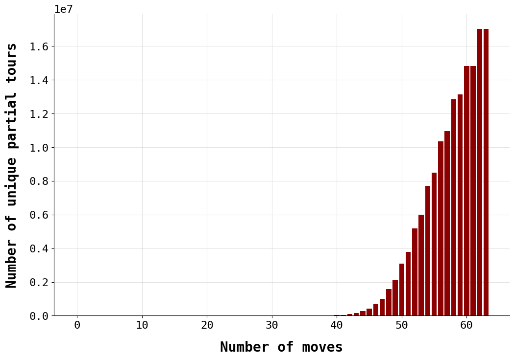

# The Knight's GPT
_An autoregressive transformer trained on millions of Knight's moves encoded as single-digit integers shows evidence of learning and generalization as it is successfully able to solve the Knight's Tour puzzle from any starting position and on unseen partial tours._

## tl;dr 
- The [Knight's Tour](https://en.wikipedia.org/wiki/Knight%27s_tour) puzzle can be summarized concisely using the following question: _Given the rules of chess, is it possible for a knight to traverse the board and visit each square only once?_
- Inspired by [Li et al. (2022)](https://arxiv.org/pdf/2210.13382) and [Ruoss et al. (2022)](https://arxiv.org/pdf/2402.04494v1), I decided to test if an autoregressive transformer model trained on millions of Knight's tour, **encoded as merely linear indices representing positions on the chessboard**, could successfully learn how to solve the puzzle.
- I used three algorithms — Warnsdorff, backtracking with Warnsdorff, and recursive backtracking — to generate little over 17 million unique Knight's tours.
- I augmented the dataset by finding all symmetric tours for and expanded the total number of tours to 136 million. Of these, ~100 million were isolated for training.
- I configured a ~57 million parameter GPT-2 model and trained it on 1%, 10%, and 25% of the data for an epoch on two P100 GPUs
- To test model generalization, I used [Parberry's algorithm](https://www.sciencedirect.com/science/article/pii/S0166218X96000108) to generate 1191 partial tours (these partial tour patterns are not present in the training dataset).
- **Preliminary Results**
    - The models virtually never make illegal Knight moves; the error rate is ~1% for the models trained on all three subsets of the training set.
    - All the models are able to solve tours from unseen starting positions (even starting positions omitted from the training data).
    - The models show some level of generalization as they are able to solve 815-999 out of the 1191 Parberry tours.
    - There is weak evidence of scaling leading to better model performance as the model version trained on 25% of the training data is able to solve the largest number of unseen Parberry tours.

## Illustrative Plots

**Figure 1.** A screengrab of one of the datasets that was omitted from training. Each row here represents a Knight’s tour on the chessboard. During training, the rows were combined as a single sequence and passed to the model for training. All the generated tours were sequences of 64 integer digits ranging from `[0, 63]`, where each digit corresponded to a position on the chessboard. While the tours were generated using adjacency lists of all the vertices, no two-dimensional positional information were encoded in the generated training data. 

**Figure 2.** This plot shows the training and evaluation loss during model training; the axes of the graphs are set to the logarithmic scale.

**Figure 3.** An example of a Parberry tour, which are generated for sub-boards separately and stictched together later. The 1191 partial tours generated for testing generalization only contained the first 40 moves on the 5 x 8 sub-board. The model generated the remaining 24 moves. 

**Figure 4.** A standard 8 x 8 tour solved by the model trained on 25% of the training data.

**Figure 5.** A Parberry tour succesfully completed by the model trained on 25% of the training data.

**Figure 6.** A case where the model trained on 25% of the training data makes an illegal Knight's move and produces a wrong solution.

**Figure 7.** In this example, the model was made to generate 256 tours from the position B2. All tours beginning from position B2 were omitted from the training set. Only three out of 256 generated examples had erroneous knight’s moves. In all the cases, the erroneous moves were made when the model "boxed itself" in one part of the board and had no legal knight’s moves left.

## Reproducibility

1. Clone this repository
2. With a python environment setup, run `pip install -r requirements.txt` to download the necessary packages
3. For data generation: note that the due to sheer size of the tours generated for
this project, your dataset may differ from the one I generated. However, all the data
generation scrips have random seeds included for better replication.
    - `generate_tours.py`: This script uses the Warnsdorff rule-based solution algorithm and multiprocessing to generate tours. Run this using the parser arguments defined to generate ~5 million tours. 
    - `generate_tours_bt.py`: This code uses Warnsdorff and backtracking to generate tours. It automatically reads the parquet file with previously generated tours and appends new tours into them. Generate ~1.5 million solutions using this script. 
    - `generate_tours_quadrant.py`: Run this script locally on your computer. No arguments are required. It will generate 18 million solutions from the top-left quadrant of the chessboard. This script should take around ~6-8 hours to run.
    - `generate_tours_parberry.py`: Use this file to create 2900 test cases to gauge model generalization.
4.  Next, navigate to `./exploratory_code/tour_augmentation_notebook.ipynb` to augment the generated tours. Note that you will have to replace the name of the generated file (as the name contains the date when the file was created) and combine the 18 tours quadrant tours from `generate_tours_quadrant.py` with the one created using `generate_tours.py` and `generate_tours_bt.py` (note these two will already be combined). After this, simply run the code sequentially to expand the dataset size by a factor of 8 and create a testing, validation, and training set.
5. Run the model using `train_model2.py` to train a smaller version of GPT-2 on the training set. Note that this script accepts arguments to train the model on multiple GPUs and a smaller portion of the data. The best model used in this project was trained on 25% of the data. However, they may need to be modified based on the length of your dataset.
6. After training, use `testing_the_models.ipynb` to gauge some basic performance measures of the model. The checkpoint name at the beginning (within `model_dirs`) will need to be modified as which checkpoint you use will depend on your training run (and how many models you train).

## Further improvements
#### 1. Better training data generation
In the beginning, I didn’t consider the board’s symmetry when generating tours. This meant that a lot of tours generated using the Warnsdorff and Warnsdorff & backtracking algorithm ended up being identical (due to symmetry). Later, I primarily used the backtracking-only algorithm to generate unique tours, and I would have saved a lot of compute and time had I started with this algorithm earlier.

A more fundamental issue is the structure of the tours due to the backtracking algorithm (the first ∼45 steps of tours beginning from a particular position tend to be identical, see figure 10). This makes the model default to a particular solution instead of creatively exploring different possible solutions (since it sees those extremely common sequences several times). The solution here would be exploring other algorithms which generate more diverse tours; I haven’t found any other algorithm yet which can generate millions of unique solutions in a reasonable amount of time.

**Figure 8.** The picture here shows that the rate of uniqueness in the training set only increases after the ∼45th move. It suggests that there may be a possible lack of diversity within training examples.
#### 2. Training on varying sequence lengths to test if the model can learn tours of varying lengths on different sized chessboards
The most efficient and successful Knight’s tour solving algorithms are able to solve tours for any chessboard (for which feasible solutions exist). My models weren’t able to do so as they weren’t trained on indices belonging to larger or smaller chessboards. Generating tours of varying lengths for various chessboards, padding them, and then training the model on such data would highlight if autoregressive models are able to generalize even further. For testing, boards not present in the training data could be used.
#### 3. Better test of scaling
Training models of varying sizes and ones trained on varying fractions of the training set could be used to test the combination of parameter and dataset size that enables these models to successfully solve combinatorial problems such as the Knight’s tour. There may exist a threshold after which models are virtually always successful at solving all unseen Parberry tours.
#### 4. Using interpretability methods to better understand the model
Linear probes or sparse autoencoders could be employed to gauge if the model has developed an internal representation of the board state or a graph structure. If such a board or graph structure is found, then it may suggest that autoregressive transformers are able to conceptualize spatial relations despite not having been explicitly trained on two-dimensional chessboard data. Such methods would also help highlight the precise reasons why the model fails at certain unseen tours.
#### 5. Masked modeling to make the model predict moves in the middle of the tour
Can the model complete tours if the first and last position are provided? Or, if the first n and last m positions are provided? Or, can the model fill in a tour when the first n moves, m moves in the middle, and o moves in the end are given? During training, a special masking token could be added to test tour generation under increased constraints.
